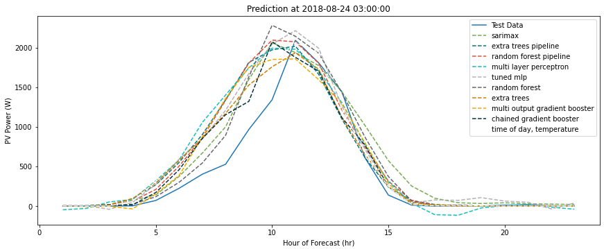

#### ESTCP Forecasters
-------------------------------------------------------------------------

This package contains a library of forecasters for use on ESTCP, a framework for comparing the performance of the different forecasters, and historical data sets for testing and training purposes. The goal is to create an automated tool chain that automatically identifies the most accurate forecaster, then uses it to forecast PV production and electricity consumption over the next 24 hours.

## General
The forecasters library (fcLib.py) contains several different forecasters. Two, the time of week temperature and time of day temperature forecasters, were developed by LBNL in prior projects and are intended to predict the electricity consumption of a building. The [SARIMAX](https://www.statsmodels.org/dev/examples/notebooks/generated/statespace_sarimax_stata.html) forecaster is an updated version of the ARIMA statistical model that includes seasonal effects and exogenous factors within the autoregressive and moving average components of the model. The others are implementations of [scikit-learn](https://scikit-learn.org/stable/) forecasters, implemented as reprogrammed classes within the forecasters library. Some directly implement scikit-learn algorithms as classes so that they are stored within the library, and others are optimized scikit-learn pipelines. The scikit-learn pipelines are the results of [TPOT](http://epistasislab.github.io/tpot/) simulations, using the tools and parameters yielding optimal performance on a testing data set.

The forecaster selector (fcSelector.py) contains a framework for comparing all of the forecasters on a dataset and selecting the option with the highest test score. This class reads the dataset provided by the user, splits it into training and testing datasets, loops through all forecasters in the library to train and test each individually, then selects the model with the highest training score. If viewing the selector tool in framework.ipynb the bottom cell presents an example.

## Getting Started
The following link permits users to clone the source directory containing the [forecasters](https://bitbucket.org/nxd/forecasters/src/master/) package.

The package depends on external modules which can be installed from pypi with `pip install -r requirements.txt`.

## Example
The 'dev' folder contains two Jupyter notebooks demonstrating the use of ESTCP forecaster tools. They are:
* **dev/forecasters.ipynb**: This notebook contains the forecasters code contained within fcLib.py and three separate tests. The first test is contained in the bootom of the first cell, and calculates the performance of all forecasters on a training data set. It performs several iterations and returns the average training score for each forecaster. The third cell in the notebook plots the performance of each forecaster on five days within the simulated data set providing a visual comparison. The fourth cell in the notebook provides a plot and visual comparison for the two forecasters designed to report building electricity consumption.
* **dev/framework.ipynb**: This notebook contains the selector code contained within fcSelector.py and an example test. The example plots the performance of several forecasters on a data set when evaluated using the selector tool, and prints the metrics for the highest performing forecaster.

The following plot presents a sample output from forecasters.ipynb showing the performance of each forecaster predicting PV power generation for the following 24 hours on August 24, 2018 in the training data set.
 

## License
This library is unlicensed. Please keep it within LBNL.

## Contact
Contact Peter Grant for questions about the forecasters library and Nicholas Deforest for questions about the selector framework.